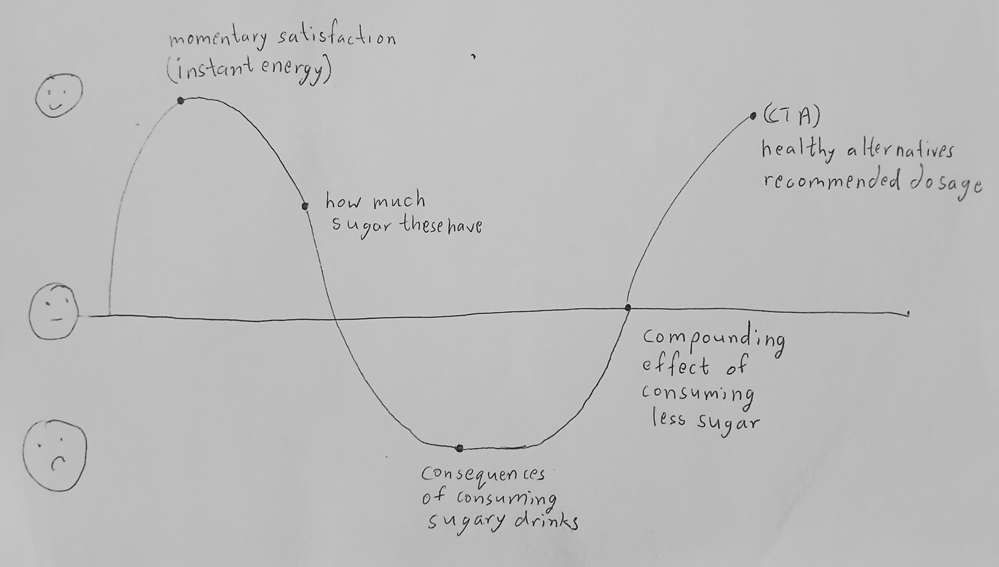
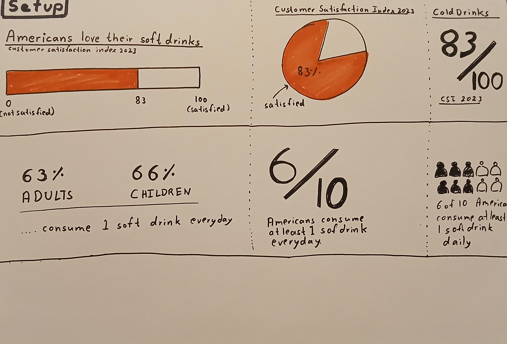
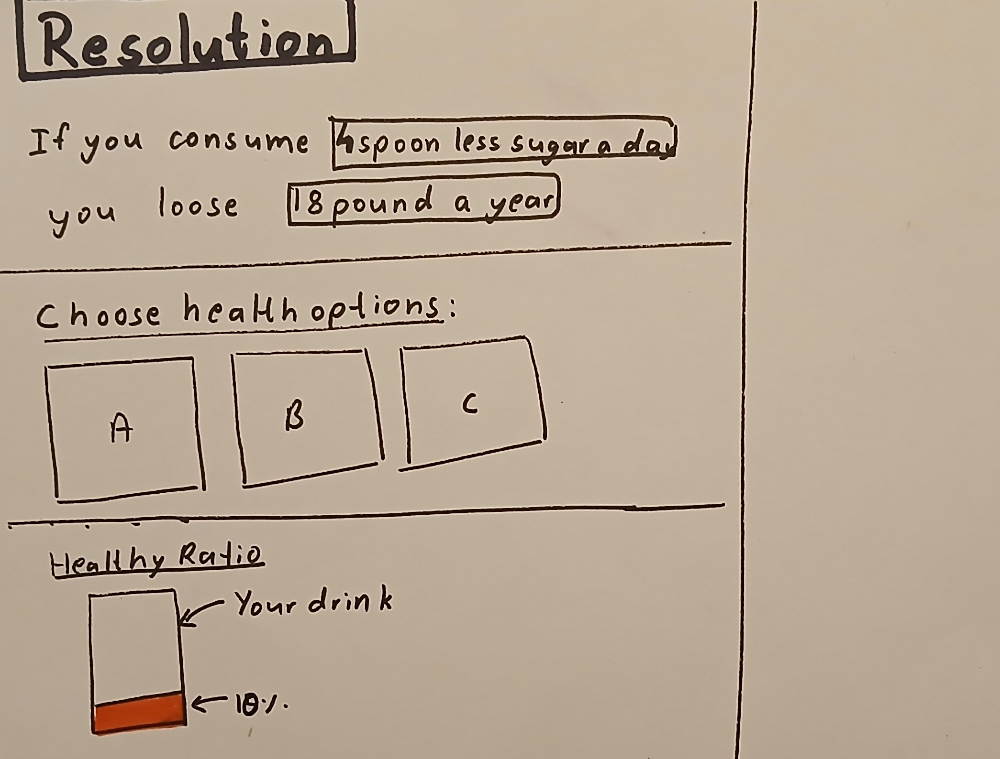

# Final Project  
#### Part 1   
---  
  
## Project Outline    
Staying hydrated and energized is key to staying healthy—water fuels everything from digestion to keeping us awake during those afternoon slumps. Yet, in the U.S., many of us seem to prefer quenching our thirst with sugary drinks instead.Sure, they taste great, but they're also sneaky little contributors to obesity and type 2 diabetes. By opting for water or healthier alternatives, we can dodge those health risks and stay hydrated without the sugar overload. Remember, small, smart swaps today might just lead to a more energized—and less sugar-crashed—tomorrow!  

#### The Core Concept   
We all know the drill—when we need a quick energy boost, we often grab a juice, soda, or maybe even an energy drink to power through the day. These are the go-to drinks that make us feel instantly satisfied. But here's the catch: they can easily sneak in more sugar than we bargained for, leading to unwanted side effects like obesity and diabetes. This project uses data visualizations to show just how much sugar we're sipping on, and the not-so-sweet impact it has on our health. Plus, it busts a few myths about so-called "healthier" sugar alternatives—because not all that glitters is stevia! 

--- 
     
## Project Structure  

#### Setup:   
This section focuses on understanding the consumption pattern of soft drinks and at the same time understand how much sugar content these beverages have.  
1) Momentary Satisfaction: This will highlight how soft drinks are most satisfying beverages reported by US consumers. Additionally, it will show the daily consumption pattern for adults and children in USA.      
2) Sugar Content: This section will showcase some stats about how much sugar these beverages have and how much is actually   

#### Conflict:
This section focuses on showing the consequences of consuming excess sugar and its impact on longterm health.   
1) Daily Sugar Intake: This section will highlight the contrast between daily requirement vs average amount of sugar consumed daily by adults in USA. This will be done by using statistics and data visualization.    
2) Consequences: This section will show obesity and type 2 diabetese death rate in USA, and focus on connecting sugar content with these health problems.  

#### Resolution:  
1) Compounding effect: This section focuses on showing the compunding effect of consuming less sugar or gradually cutting down excess sugar from one's diet.  
2) Suggestive Changes: This section will also suggest alternatives and their recommended dosage.  
   
--- 
   
## Initial Sketches  
  
  
  
  
  
---    

## Data

#### Global Sugar Consumption  
According to data from the [World Population Review](https://worldpopulationreview.com/country-rankings/sugar-consumption-by-country), the U.S. ranks among the top countries for sugar consumption per capita. A large portion of this sugar comes from sugary drinks like sodas, energy drinks, and sweetened teas, which are consumed regularly by a significant percentage of the population. This high intake of sugar from beverages contributes to the growing global concern over health risks linked to excessive sugar consumption.  

#### Calories in Drinks   
The CDC’s [Rethink Your Drink](https://www.cdc.gov/healthy-weight-growth/rethink-your-drink/index.html) resource highlights how sugary beverages are packed with hidden calories. For instance, a single can of soda can contain over 150 calories, all from sugar. Energy drinks, sweetened teas, and flavored juices often contain even more. These drinks, while providing instant gratification, can quickly exceed daily caloric needs when consumed regularly, leading to weight gain and increasing the risk of health issues.  

#### Recommended Sugar Intake    
The [American Heart Association](https://www.heart.org/en/healthy-living/healthy-eating/eat-smart/sugar/how-much-sugar-is-too-much#:~:text=Men%20should%20consume%20no%20more,or%20100%20calories) recommends that men consume no more than 36 grams (150 calories) of added sugar per day, and women no more than 25 grams (100 calories). Many sugary drinks exceed these limits in just one serving. For example, a single 12-ounce soda often contains more than 40 grams of sugar—surpassing the daily limit in just one drink. This data emphasizes how easy it is to unknowingly consume too much sugar through beverages alone, putting people at risk for serious health issues.  

#### Deaths Due to Obesity in the USA  
Obesity, driven in part by excessive sugar intake, especially from sugary drinks, is a leading public health crisis. Data from [Our World in Data](https://ourworldindata.org/grapher/deaths-due-to-obesity?tab=chart&country=~USA) shows a rising trend in deaths linked to obesity in the U.S. By consuming high-calorie sugary drinks regularly, individuals increase their risk of becoming overweight or obese, leading to serious health complications.  

#### Percentage of Deaths by Diabetes Type  
The [Deaths from Diabetes by Type](https://ourworldindata.org/grapher/deaths-from-diabetes-by-type?country=OWID_WRL~USA) chart from Our World in Data demonstrates the deadly consequences of diabetes, especially type 2 diabetes, which is closely linked to high sugar consumption. Sugary drinks contribute significantly to insulin resistance and weight gain, both of which are major factors in the development of type 2 diabetes. By highlighting the sugar content in these drinks, the connection between beverage choices and diabetes becomes clearer.  

--- 
   
## Method Medium
#### Figma, Flourish, Tableau  
I will use the combination of these softwares to build data visualizations to build my story. Tableau and Flourish are great in building interactive data visualisations whereas Figma can help me with static data visualizations.  

#### Figma/Google Slides  
Figma is best for end-to-end projects, so I can build some visualizations and presentation within same platform. However, I might shift to Google Slides for presentation as it offers much more flexibility and accessibility.  

#### Shorthand  
Shorthand will be used to have detailed narrative and elaborate version of the presentation. The software includes features that present the content in an engaging, interactive way, making it a valuable tool for users to explore independently and at their own pace.    
