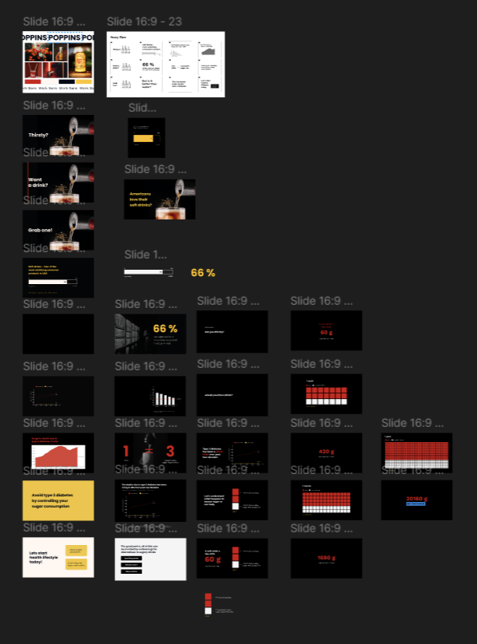

| [Home](./README.md)              | [Government Debt](./GOVTDEBT.md)  | [Infection Awareness](./INFAWARE.md) | [Final Project: Part 1](./FinalProject.md) | [Final Project: Part 2](./final-project-part-two.md) | [Final Project: Part 3](./final-project-part-three.md) |
---
[Final story](https://carnegiemellon.shorthandstories.com/sugar-content-in-soft-drinks/index.html)

[Final presentation](https://carnegiemellon.shorthandstories.com/presentation-sweet-seduction/index.html)

# Final Project: Part 3
## Summary  
This part showcases the journey that went into curating the Part 3 of "Sweet Seduction". A lot of tools and data sets were used to curate this piece. This outcome is a combination of Tableau, Figma, Unsplash, Shorthand and datasets from various sources.  

## Inspiration
I grew up as an athlete, but eventually towards my teenage I became about 95kgs. All thanks to the unhealthy food and lots of soft drinks. When I was 16 I took a resolution of getting fit and indulging in healthy habits, seeing people around me braving through diabetese. That's when my understanding of healthy food and sugar consumption started. This project is an extension of my knowledge and experience over the years, so that young adults around me can understand the effect of sugar consumption visually.

## Target Audience  
This project is aimed for young adults in USA. Per my research soft drinks and sugary drinks are consumed on daily basis in USA by young adults either to stay hydrated or to get quick boost in energy. A can of soft drink contains so much sugar that you can add 20-30 pounds of weight in a year if you drink daily. This story is aimed at those young adults who casually srink these sugary drinks for fun or as a source of energy.   

## Some of the highlighting feedback after Part 2:
1. The impact of sugar consumptions was not communicated, users were saying the numbers are not helping and may be some visuals would help.      
2. There was also some feedback around the choice of colors, Initailly I used a lot of yellow. This took away the seriousness of the topic, this wasn't evident until one said yellow is a happy color.  

## Behind The Scenes  
Here is a peep into my Figma board and Tableau where I made iterations before I crafted the final version. I used Tableau to explore datasets and used Figma to translated the final visualizations to the design language as per my moodboard. I found out that fine tuning visuals in Figma helped me quickly iterrate and show improvisations to my users and engage in some deep conversations. Since I only had 3 people, this to and fro helped me refining and delivering the final version. 

  

  

  

## Reflection  
In the development of "Sweet Seduction: Choices & their consequences"," I encountered a significant challeneg in sourcing data and weaving it together to build the narration. In the begining I was in a difficult spot as I wasn't able to communicate the effect of sugar consumption. However, my constant itteration and user feedback eventually paid off, helping me create a meaningful story that I was visualizing from the begining.  

​When it came to data visualizations, my focus was on creating minimal designs that can be read at scrolling pace. I deliberately added short paragraphs to create pause in the story for the viewer to stop and think while scrolling. My aim here was to create moments where user can feel the impact and then moments where user can pause and think about it.  
Overall this journey of deriving meaning from the boring data sets and creating a story out of it was fun and brought a new outlook to how data can be presented or conveyed.  

This final project is a reminder to the young adults in USA who consume soft drinks casually everyday without thinking about the consequences it brings in the later stage of life.  

## References

### Deaths due to type 2 diabetes:
Roser, M., Ritchie, H., & Ortiz-Ospina, E. (2024). Deaths from diabetes by type. Our World in Data.  
<https://ourworldindata.org/grapher/deaths-from-diabetes-by-type?country=OWID_WRL~USA>

IHME, Global Burden of Disease (2024) – with minor processing by Our World in Data. “Type 2 Diabetes” [dataset]. IHME, Global Burden of Disease, “Global Burden of Disease - Deaths and DALYs” [original data].

---

### Amount of sugar in a drink:
Bender, R. (2023, May 16). Guess how much sugar is in a can of soda? Verywell Fit.   
<https://www.verywellfit.com/guess-how-much-sugar-is-in-a-can-of-soda-2506919> 

American Heart Association. (2023). Added sugars. American Heart Association.   
<https://www.heart.org/en/healthy-living/healthy-eating/eat-smart/sugar/added-sugars> 

Callon, N. (2012). Soft drink sugar awareness [Photograph]. Public domain, via Wikimedia Commons.  
<https://upload.wikimedia.org/wikipedia/commons/c/ce/MPOTY_2012_soft_drink_sugar_awareness.jpg.> 

--- 

### Soft drink consumption in USA:
Centers for Disease Control and Prevention. (2021, May 27). Sugar-sweetened beverage intake. CDC.   
<https://www.cdc.gov/nutrition/data-statistics/sugar-sweetened-beverages-intake.html>

Soft drink consumer satisfaction:
American Customer Satisfaction Index. (2024). Nondurable products. ACSI.   
<https://theacsi.org/industries/manufacturing/nondurable-products/>  

---

### Sugar & type 2 diabetes:
Centers for Disease Control and Prevention. (2023, June 7). Insulin resistance and type 2 diabetes. CDC.   
<https://www.cdc.gov/diabetes/about/insulin-resistance-type-2-diabetes.html>

Stoll, K. (2023, March 10). Can eating too much sugar cause diabetes? University Hospitals.   
<https://www.uhhospitals.org/blog/articles/2023/03/can-eating-too-much-sugar-cause-diabetes>  

---
[Final story](https://carnegiemellon.shorthandstories.com/sugar-content-in-soft-drinks/index.html)

[Final presentation](https://carnegiemellon.shorthandstories.com/presentation-sweet-seduction/index.html)

---

### Alternatives to soft drinks:
Plass, S. (2022, December 21). Soda alternatives. Everyday Health.   
<https://www.everydayhealth.com/photogallery/soda-alternatives.aspx>
